# 基于springboot的课程答疑系统

#### 介绍

本课程答疑系统是基于Spring Boot框架开发的，旨在提供一个高效、便捷的在线学习环境，以便学生、老师和管理员之间进行课程答疑、交流和信息管理。系统采用模块化设计，拥有清晰的角色划分，包括管理端、老师端和学生端，每种角色都拥有特定的功能权限，确保系统的安全性和易用性。

#### 技术栈

后端技术栈：Springboot+Mysql+Maven

前端技术栈：Vue+Html+Css+Javascript+ElementUI

开发工具：Idea+Vscode+Navicate

#### 系统功能介绍

.1 管理端  
个人中心：管理员可以查看和修改个人信息，如用户名、密码等。  
学生管理：详细记录学生的注册信息，包括姓名、学号、班级等，并支持批量操作。  
老师管理：管理教师的注册信息，包括姓名、职称、所教科目等，确保教师信息的准确性。  
科目类型管理：支持添加、修改和删除课程科目类型，满足不同学科的教学需求。  
学生问题管理：实时查看学生提出的问题，并可以对其进行分类、统计和分析。  
老师回答管理：对老师的回答进行质量评估，确保学生得到高质量的解答。  
关注列表管理：管理员可以关注特定用户或话题，以便及时了解相关信息。  
交流区：提供一个论坛或聊天室，方便管理员、老师和学生之间的交流和互动。  
系统管理：包括系统参数设置、用户权限管理、数据备份与恢复等功能，确保系统的稳定运行。  

2 老师端  
学生问题：老师可以实时查看学生提出的问题，并给出专业的解答。  
老师回答：老师可以查看自己回答的问题列表，并进行编辑或删除。  
交流区：老师可以参与或创建话题，与学生和管理员进行交流。  
个人中心：老师可以查看和修改自己的个人信息，如姓名、职称、所教科目等。  
关注列表管理：老师可以关注特定学生或话题，以便及时了解学生的学习情况。  

3 学生端  
学生问题：学生可以随时随地提出问题，并获得老师的及时解答。  
老师回答：学生可以查看老师对自己问题的回答，并给出反馈。  
交流区：学生可以参与或创建话题，与老师、同学和管理员进行交流。  
个人中心：学生可以查看和修改自己的个人信息，如姓名、学号、班级等。  

#### 系统作用

1.提高学习效率  

学生可以快速提出问题，并获得老师的及时解答，避免了因等待解答而浪费的时间。  
老师可以集中回答学生的问题，提高了工作效率。  

2. 优化学习体验  

学生可以通过系统方便地查看自己的学习记录和问题历史，了解自己的学习情况。  
老师可以通过系统了解学生的问题类型和难度，为教学提供更有针对性的指导。  

3. 促进师生交流  

交流区功能为学生、老师和管理员提供了一个自由的交流平台，促进了彼此之间的了解和互动。  
关注列表功能使得用户可以关注自己感兴趣的用户或话题，增加了交流的针对性和互动性。  

4. 数据统计与分析  

系统可以实时统计和分析学生问题的数量、类型、难度等信息，为教学提供有力的数据支持。  
老师可以通过查看自己的回答质量和数量，对自己的教学工作进行反思和改进。  

5. 安全性与稳定性  

系统采用先进的加密技术和安全措施，确保用户数据的安全性和隐私性。  
系统经过严格的测试和优化，确保在高并发和大数据量的情况下依然能够稳定运行。  
 
#### 系统功能截图

代码结构

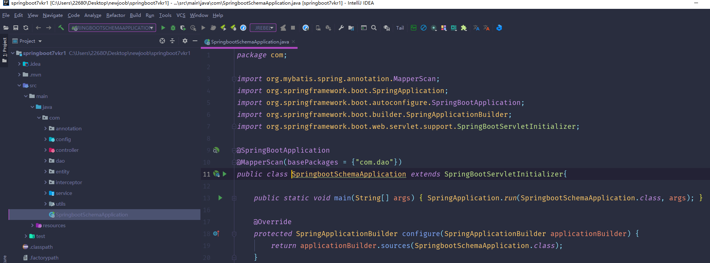

数据库表

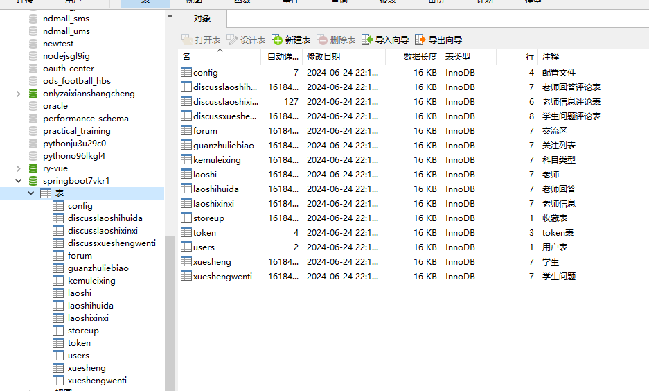

登录

学生管理

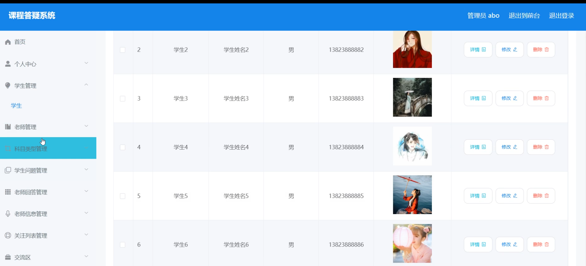

科目类型管理

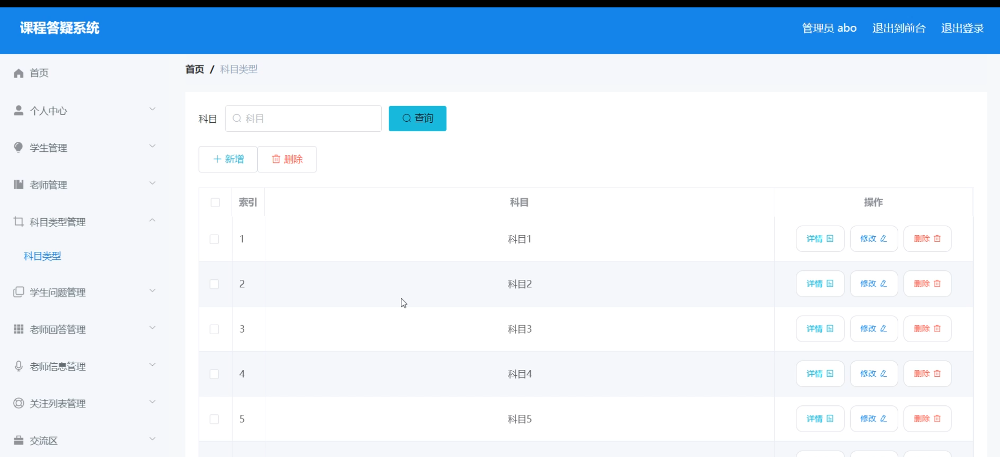

学生问题管理

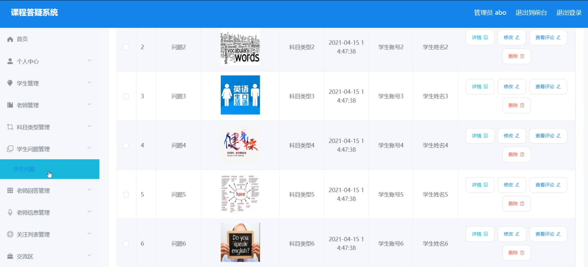

老师信息管理

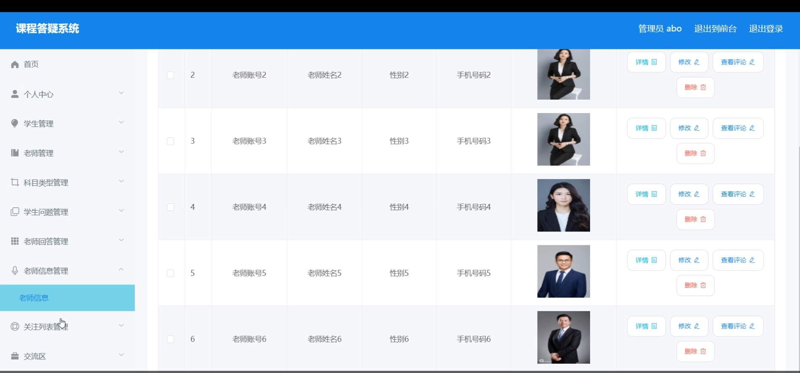

学生端个人信息

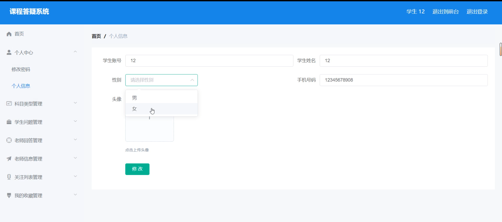

新增学生问题

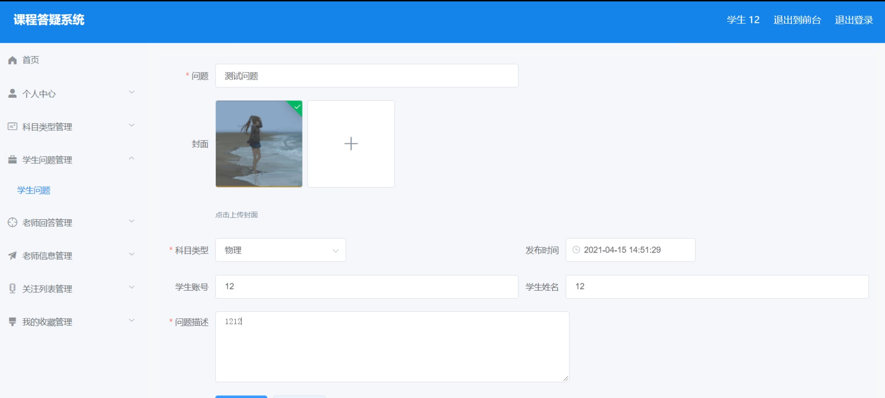

老师端个人信息

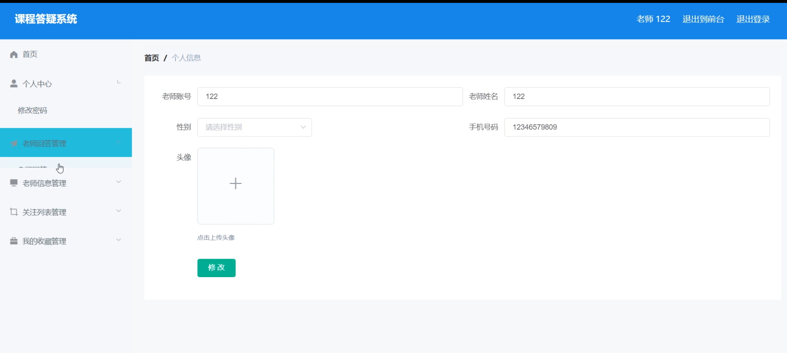

关注列表

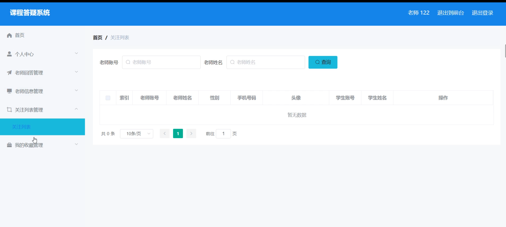

前台页面首页

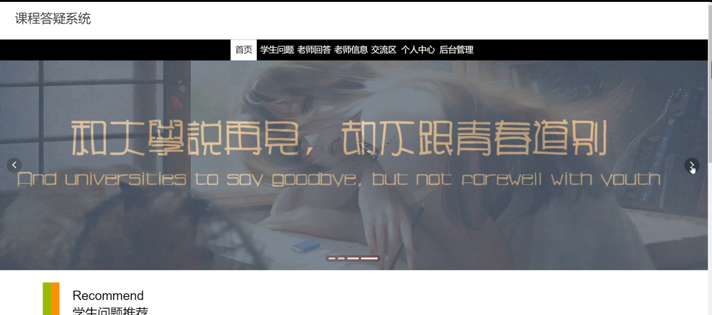

交流区

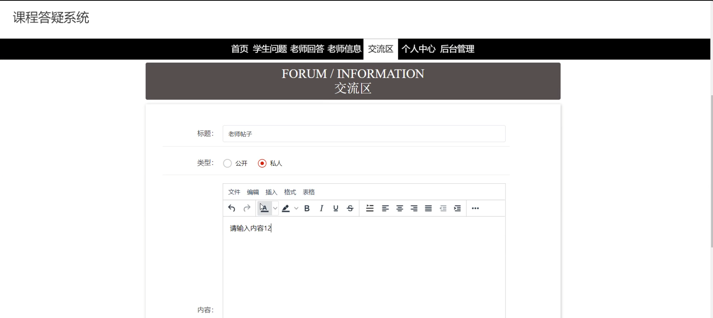

#### 总结

程答疑系统是一个功能强大、易于使用的在线学习平台，它通过清晰的角色划分和模块化设计，实现了学生、老师和管理员之间的有效沟通和互动。系统不仅提高了学习效率和质量，还促进了学习资源的共享和交流，为学生和老师提供了一个良好的学习环境。随着技术的不断发展和用户需求的不断变化，我们将继续优化和完善系统功能，以更好地满足用户的需求。

#### 使用说明

创建数据库，执行数据库脚本 修改jdbc数据库连接参数 下载安装maven依赖jar 启动idea中的springboot项目

后台地址：http://localhost:8080/springboot7vkr1/admin/dist/index.html

管理员  abo 密码 abo

前台地址：http://localhost:8080/springboot7vkr1/front/index.html
